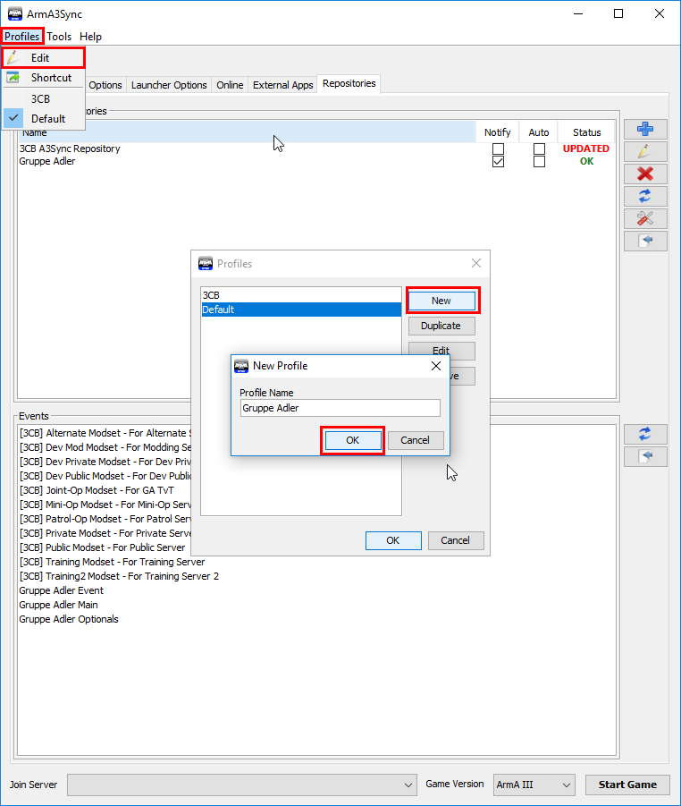
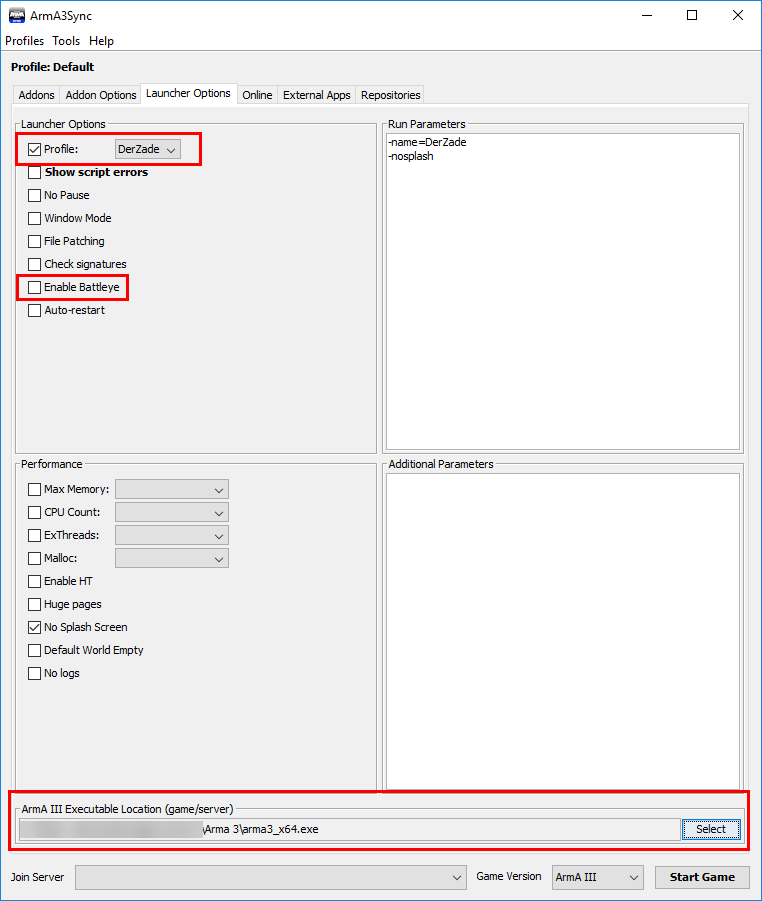
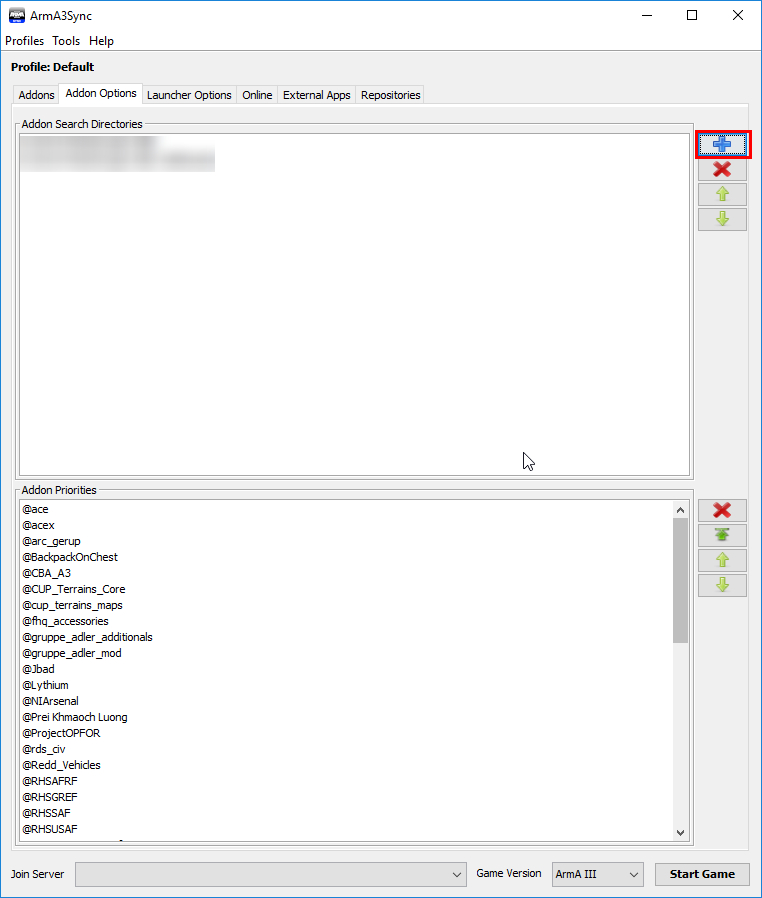
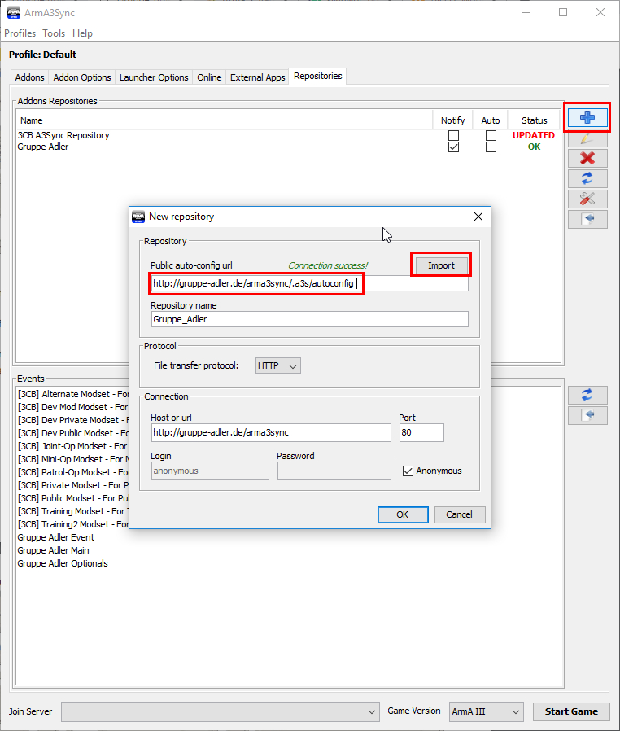
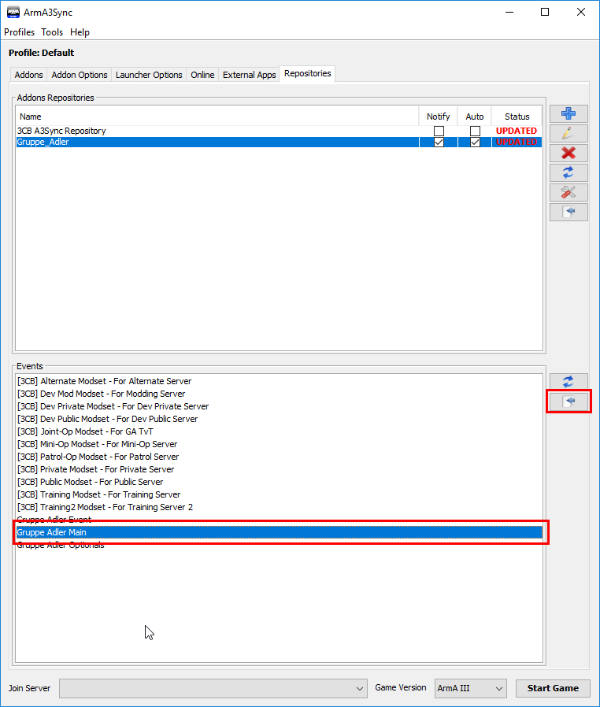
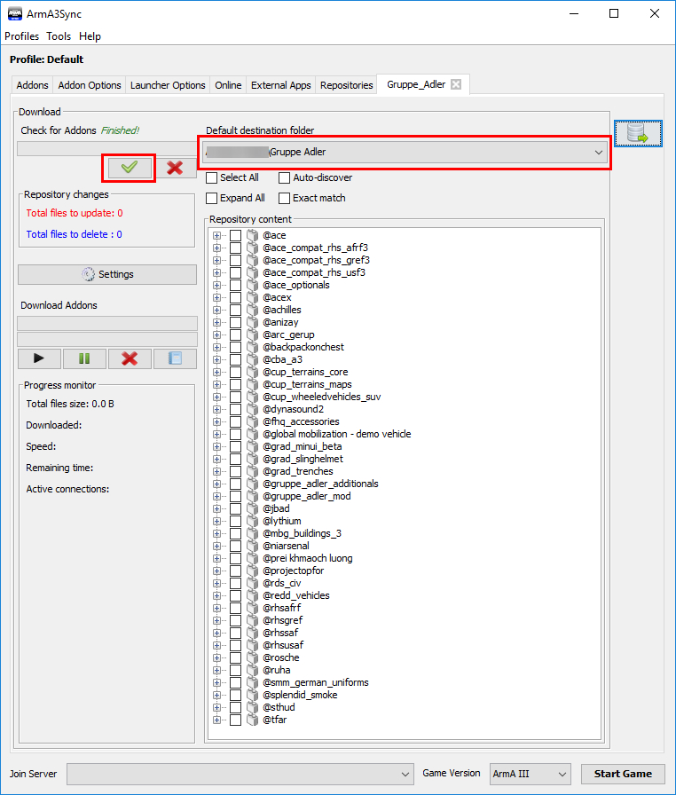

# Gruppe Adler Modset

## Einleitung 
Die Gruppe Adler benutzt ein Repository (Repo) aus verschiedenen Mods um die Spielerfahrung auf unsere Bedürfnisse anzupassen.

Für die Aktualisierung verwenden wir Arma3Sync (A3S)

## Übersicht

Die Gruppe Adler benutzt im wesentlichen folgende Mods:

* ACE
* CUP Terrains
* RHS
* TFAR

Eine detaillierte Übersicht mit allen Mods einschließlich Versionsnummern und Quellenlinks ist im Forum zu finden: [Gruppe Adler Mod-Paket Forenlink](https://forum.gruppe-adler.de/topic/361)

## Aufteilung des Repository 

Unser Repository beeinhalten insgesamt drei Events (Modsets). Abhängig davon, bei welchen Events teilnommen werden soll, werden nicht alle Mods benötigt. 

* **Gruppe Adler Main**  
Dieses Modset enthält alle Mods die für normalen Spieltage gebraucht werden. 
* **Gruppe Adler Event**  
Dieses Modset ist eine Teilmenge des _Gruppe Adler Main_, enthält aber nur die absolut nötigsten Mods. Wir benutzen dieses Modsets wenn Partnerclans bei uns zu Gast sind. 
* **Gruppe Adler Optionals**  
Hier findest du alle optionalen Addons die du mitladen darfst, aber nicht musst. Hierbei handelt es sich auschließlich um Addons die nur Auswirkungen für den Client haben (Sound, Userinterface etc.)

## Repository anlegen und konfigurieren

### Installation Arma3Sync
Für das Herunterladen wird Arma3Sync benötigt. Die aktuelle Version ist [hier zu finden](http://www.armaholic.com/page.php?id=22199). Diese einfach herunterladen und installieren. 

### Anlegen eines neuen Profils
Es ist zwar nicht unbedingt notwenig, aber empfehlenswert für jedes neues Repository ein neues Profil zu erstellen um Fehler vorzubeugen.  

Ein neues Profil lässt sich unter `Profiles` → `Edit` → `New` erstellen.  
::: tip TIPP
Nachdem das neue Profil erstellt wurde sollte Arma3Sync neu gestartet werden.  
:::



### Grundlegende Einstellungen

Im Tab `Launcher Options` sind die grundlegenden Einstellungen zu finden. 
Hier kann alles vom Arma 3 Installations Pfad bis zu Startup Parameter kofiguriert werden.
Die Einstellungen die vorgenommen werden müssen sind:
* `Profile`  
Hier das Profil mit dem gewünschten Nickname auswählen
* `ArmA III Executable Location (game/server)`  
Hier den Pfad zur _arma3_x64.exe_ angeben. Diese lässt sich im Installations Verzeichnis zu finden. 
::: tip TIPP
Das Arma Installations Verzeichnis lässt sich folgendermaßen finden:  
Steam öffnen → Rechtsklick auf Arma 3 → _Eigenschaften_ → _Lokale Dateien_ → _Lokale Dateien durchsuchen_
:::



Im Tab `Addon Options` muss nun noch ein Ordner eingestellt werden, in welchem nachher die Mods gespeichert werden. 
Dazu einfach rechts auf das blaue Kreuz klicken und den gewünschten Pfad auswählen.
::: warning WARNUNG
Um Fehler zu vermeiden sollte als Verzeichnis nicht das Arma-Verzeichnis gewählt werden, da sonst Probleme mit Workshop-Mods aus Steam entstehen könnten, bei denen A3S nicht eindeutig bestimmen kann, welche Variante des Mods gepatcht bzw. geladen werden soll.

Falls die Mods dennoch im Arma-Verzeichnis liegen sollen, sollte mindestes ein Ordner _"Gruppe Adler Mods"_ im Arma-Verzeichnis erstellt und gewählt werden.
:::



### Anlegen des Repository
Ein neues Repository lässt sich im `Repository` Tab anlegen.  
Hierzu - auf der rechten Seite - auf das blaue Kreuz klicken. Im neu geöffnenten Fenster das Folgende in das Feld `Public auto-config url` eintragen:  
```http://gruppe-adler.de/arma3sync/.a3s/autoconfig```  
Danach auf `Import` drücken. Die Verbindung war erfolgreich wenn über dem Eingabefeld _Connection success!_ steht. 



::: tip TIPP
A3S bietet im Tab `Repositories` für alle Repositories noch folgende hilfreiche Einstellungen:
* **Notify:** A3S zeigt beim Starten an, wenn dieses Repo ein Update erhalten hat.
* **Auto:** A3S aktualisiert das Repo automatisch, sobald ein Update verfügbar ist. (Hierzu muss A3S natürlich laufen)
:::

### Herunterladen/Aktualisieren der Mods
In der Liste der Event das gewünschte Event auswählen und rechts neben der Liste auf den Knopf mit dem blauen Pfeil klicken. 



Ein neuer Tab mit dem gewählten Event erscheint. Hier muss unter `Default destination folder` das Verzeichnis, welches unter [Grundlegende Einstellungen](#grundlegende-einstellungen) erstellt wurde.  
Mit dem Knopf mit dem grünen Haken kann die Aktualität der Mods überprüfen. 

::: tip TIPP
Alle Mods, die mit einem gelben Warnzeichen versehene sind, müssen aktualisiert werden.  
Rot = neue Mod / Blau = Mod wird gelöscht / Schwarz mit gelben Warnzeichen = Mod wird aktualisiert 
:::

Bevor der Download mit dem schwarzen Play Knopf gestartet werden kann, sollten die Anzahl der maximal aktiven Verbindungen auf den maxinalen Wert gestellt werden `Settings` → `Maxinum number of connections`

//TODO: Herunterladen und überprüfen ob alles up-to-date




### Anlegen einer Addon Group

//TODO